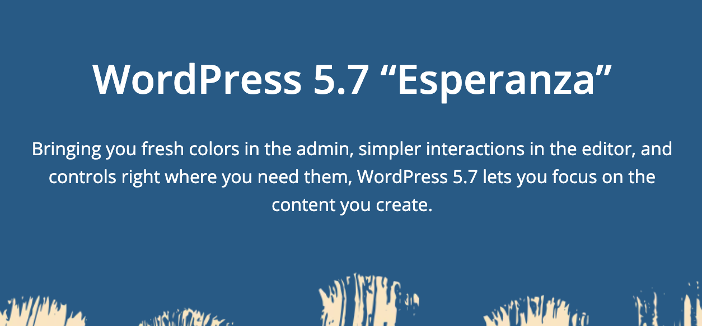

Wordpress 5.7 [Esperanza](https://wordpress.org/news/2021/03/esperanza/) came out last week and saying that it was simply a “rewarding experience” is an understatement. My initial feeling was relief. But then I thought about how I made it through coordinating a release for an open-source project that is responsible for powering at least [40%](https://w3techs.com/technologies/details/cm-wordpress) of the websites on the internet. How mind boggling and strange… and fucking cool!



As a black woman, I always saw it as an obstacle to get involved in a project that you are passionate about when the space is commonly dominated by males.

After showing interest in taking on a lead role for the next major release, Francesca Marano approached me with the offer to take on the Release Coordinator role for WordPress 5.7. I didn’t really know what was in store as I was hoping for something more code-centric (like Core Tech Lead) but I also understand that I do not have enough experience for that. And although I didn’t have any experience with this r but I just said 👍🏾.

The first insight I received into what this role entails was provided by the [Core Handbook](https://make.wordpress.org/core/handbook/about/release-cycle/wordpress-release-team-and-focus-leads/#release-co-ordinatorhttps://make.wordpress.org/core/handbook/about/release-cycle/wordpress-release-team-and-focus-leads/#release-co-ordinator). And then after meeting with Francesa, who has coordinated many releases prior, to chat more about the role, I set off on my journey.

## Dev chats


Dec chats are weekly meetings... The Dev Chat Agenda should be published at least 24 hours prior to the 20:00 UTC dev chat. This was nerve-wracking at first but it ended up being the easiest task out of all of the release coordination. It was made easy mostly due to the amazing release squad doing constant peer revision and providing feedback (That’s one thing I loved the most FYI. The constant support for whatever you need help with). Plus I enjoyed the incentive to read the most recently published posts on [Make WordPress Core](https://make.wordpress.org/core/) for inclusion in the agenda.

*Side note:*\
There is a really cool time conversion plugin on WordPress.org and it is responsible for the automatic timezone conversion that you see below. On the editor/back-end, you use a shortcode like:

```xml
[time]February 4, 2021 9:35 am America/Chicago[/time]
```

And on the front-end, it will properly convert the time for that user. This side note is mostly for me as I plan to dig into the [code](https://github.com/WordPress/wordpress.org/blob/master/wordpress.org/public_html/wp-content/mu-plugins/pub/wporg-time-shortcode.php) and create my own version of this ✨ 

Along with publishing [dev chats](https://make.wordpress.org/core/2021/03/02/dev-chat-agenda-for-march-3rd-2021/), I began to prep for running dev chats. At first, I wrote scripts for each dev chat! But after running my 6th or 7th one, I began to go with the flow more and do it without any guidance outside of the previously published agenda. In the beginning, I didn’t understand what people were talking about. So I never contributed much to the conversations around topics like… but that comfort and experience comes with time so I don’t fault myself for not being able to even in this very moment.

## First milestone: Beta 1

The [Beta 1](https://wordpress.org/news/2021/02/wordpress-5-7-beta-1) milestone marked the first release of the development version of WordPress 5.7 and a few important things (from a release coordinator perspective) happened directly before and on this day.

* Drafted release announcement post with a closing haiku 😂
* Checked in with triage lead (Tonya Mark) on the commit status of [Trac](https://core.trac.wordpress.org/) tickets marked for 5.7 milestone.
* Made sure the following roles are filled for the release party:
* * Committer
  * A person with Mission Control access
  * A member of the security team
* Ran the release party 🎉

Fun fact: new features and enhancements must be committed by [Beta](https://make.wordpress.org/core/handbook/about/release-cycle/) 1. Any following releases of the WordPress versions will only contain defect work.

If you’ve never attended a release party, it is basically a Slack meeting in the #core channel at a predetermined time run the final test suites, bundle up the WordPress code into a package and then ask all attendees to test the installation process of this newly bundled package. If things go well after having tested the various method of installing the WordPress package, an announcement is made to the open world that the version is available to test.

As the emcee (i.e. person running the release party), it was important that there were people available to fulfill the aforementioned roles because they have tasks to complete during the release party and it will ensure that the party goes smoothly and efficiently. 

Thank you so much to Josepha Haden Chomphosy, JB Audras, Sergey Biryukov, Francesco Marano, Jonathan Desrosiers, Jake Spurlock, Tonya Mark and David Baumwald for consistently making themselves available for guidance and/or to fulfill these roles!

The current release party [instructions](https://make.wordpress.org/core/handbook/about/release-cycle/releasing-beta-versions/) are very dense to be honest but Tonya Mark provided a more user-friendly version that ended up helping me immensely and it led me to understand the handbook instructions a lot better. One of my post-release tasks is to improve these instructions so that a more user-friendly version will be available to future release coordinators.

## Following Betas and RCs

The milestones after Beta 1 included the following:

* [Beta 2](https://wordpress.org/news/2021/02/wordpress-5-7-beta-2)
* [Beta 3](https://wordpress.org/news/2021/02/wordpress-5-7-beta-3)
* [RC 1](https://wordpress.org/news/2021/02/wordpress-5-7-release-candidate)
* [RC 2](https://wordpress.org/news/2021/03/wordpress-5-7-release-candidate-2)
* [RC 3](https://make.wordpress.org/core/2021/03/05/wordpress-5-7-release-candidate-3) (unplanned but needed due to reported blocking issues resulting in codebase change)

The process was pretty much the same as before so I won’t go into details about these.

Because my next section about the final release another lengthy section, I have split this post into 2 parts. Part 2 will be live in a couple days but thank you so much for taking the time to read about my experience so far.